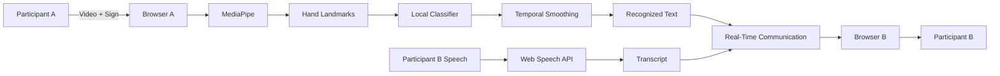
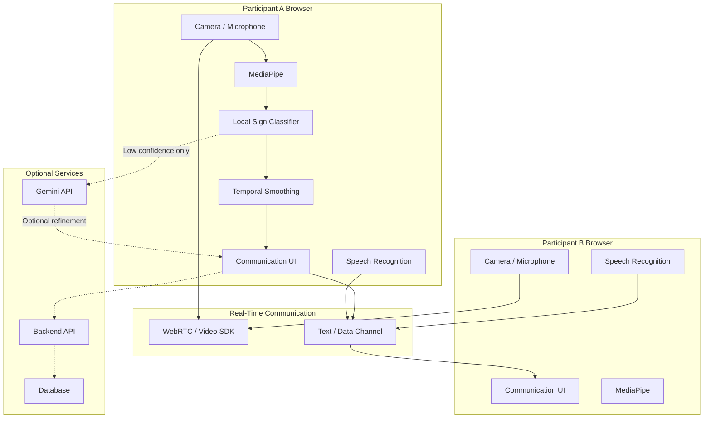

# Ishara_MergeSort
Ishara is an accessibility focused platform that makes communication between sign language users and speaking users easier using real time hand gesture recognition. Ishara also helps users learn basic signs, practice their skills, track progress, and earn badges.

# Ishara

> **Accessible communication through video, speech, and limited-vocabulary sign recognition.**

Ishara is a browser-based accessibility platform designed to support **two-way communication between signing and non-signing users** through a combination of 1:1 video calling, isolated hand-sign recognition, speech-to-text, real-time text exchange, and interactive sign-language practice.

Built as a **24-hour hackathon prototype**, Ishara focuses on a small, validated vocabulary of isolated signs rather than attempting full continuous Indian Sign Language translation.

---

## Problem Statement

Communication can become difficult when a deaf or hard-of-hearing person communicates with someone who does not understand sign language.

Existing solutions may require specialized applications, hardware, trained interpreters, or complex AI models. This creates an accessibility gap, particularly in spontaneous communication situations.

There is a need for a lightweight solution that can use devices people already have, such as a **webcam and microphone**, to provide basic communication assistance without requiring specialized hardware.

---

## Our Solution

Ishara combines video communication with two complementary recognition channels:

### Sign → Text

A user performs one of the supported isolated hand signs in front of their webcam.

```text
Webcam
   ↓
MediaPipe
   ↓
Hand Landmarks
   ↓
Local Classifier
   ↓
Temporal Smoothing
   ↓
Recognized Sign
   ↓
Text
   ↓
Other Participant
```

### Speech → Text

A user speaks into their microphone.

```text
Microphone
   ↓
Web Speech API
   ↓
Speech Transcript
   ↓
Text Transfer
   ↓
Other Participant
```

This allows both participants to communicate through a combination of **video and automatically generated text**.

---

# Key Features

### 🎥 1. 1:1 Video Communication

Two participants can join the same communication room and interact through their webcams and microphones.

### 🤟 2. Limited-Vocabulary Sign Recognition

The browser processes hand movements locally and recognizes a small set of supported isolated signs.

The MVP targets approximately **5–8 validated signs**.

### 💬 3. Real-Time Text Communication

Recognized signs and speech transcripts are converted into text and displayed to the other participant.

### 🎙️ 4. Speech-to-Text

Speech recognition runs through the browser's supported speech recognition capabilities, allowing spoken communication to appear as text.

### 📚 5. Practice Mode

Users can learn supported signs through short lessons and practice them using the same recognition pipeline used during communication.

### 🏆 6. Progress and Gamification

Users can track practice progress and earn badges, with a simple leaderboard for engagement.

### 🤖 7. Optional AI Assistance

Gemini can optionally be used as a low-frequency fallback for uncertain recognition cases.

The core application does **not depend on Gemini**.

---

# How It Works

## Communication Flow



The system primarily processes recognition **inside the browser**, reducing the need to continuously send video frames to a server.

---

# System Architecture



---

# Technology Stack

| Layer               | Technology                          | Purpose                                              |
| ------------------- | ----------------------------------- | ---------------------------------------------------- |
| Frontend            | React + Vite                        | User interface and application logic                 |
| Hand Processing     | MediaPipe Tasks Vision              | Hand detection and landmark extraction               |
| Sign Recognition    | Local landmark-based classifier     | Recognition of supported signs                       |
| Speech-to-Text      | Web Speech API                      | Browser-based speech transcription                   |
| Video Communication | WebRTC / selected video SDK         | 1:1 audio and video communication                    |
| Real-Time Data      | WebRTC Data Channel / SDK messaging | Transfer recognized text                             |
| Optional AI         | Gemini                              | Low-frequency fallback for uncertain cases           |
| Backend             | Node.js + Express                   | Room/progress-related services if required           |
| Database            | MongoDB                             | Persistent progress and leaderboard data if required |
| Hosting             | Vercel / equivalent                 | Web application deployment                           |

> The final implementation will use only the technologies required by the approved architecture. Alternatives listed here are not automatically part of the implementation.

---

# Sign Recognition Pipeline

Ishara does **not** attempt unrestricted continuous sign-language translation.

Instead, the MVP uses isolated recognition for a small, controlled vocabulary.

```text
Camera Frame
     ↓
Hand Detection
     ↓
21 Hand Landmarks
     ↓
Feature Representation
     ↓
Local Classification
     ↓
Confidence Check
     ↓
Temporal Smoothing
     ↓
Supported Sign
     ↓
Text Output
```

### Why temporal smoothing?

Individual camera frames can produce noisy predictions.

For example:

```text
Frame 1 → Hello
Frame 2 → Hello
Frame 3 → None
Frame 4 → Hello
Frame 5 → Hello
```

Instead of immediately changing the output for every frame, the system looks for a consistent prediction over several frames.

This helps reduce accidental changes in the displayed result.

---

# Supported Sign Vocabulary

The MVP is designed around approximately **5–8 validated isolated signs**.

The final vocabulary will be determined after collecting and testing examples under the intended demo conditions.

Possible examples include:

* Hello
* Thank You
* Yes
* No
* Help
* Good
* Sorry
* Please

> These labels should only be presented as supported signs after they have been validated with the project's actual recognition pipeline.

MediaPipe's built-in gesture categories are **not treated as complete Indian Sign Language recognition**.

---

# Speech-to-Text

The speech communication pipeline is:

```text
User Speech
    ↓
Microphone
    ↓
Browser Speech Recognition
    ↓
Interim Transcript
    ↓
Final Transcript
    ↓
Text Transfer
    ↓
Receiver
```

Only the resulting text needs to be exchanged between participants for the MVP.

The receiving browser does not need to independently process the speaker's audio.

### Browser Support

Speech recognition depends on browser support.

The application should detect unsupported browsers and provide an appropriate message instead of silently failing.

The MVP is primarily intended for testing in supported Chromium-based browsers.

> Browser speech recognition should not be assumed to be fully offline.

---

# Practice Module

Ishara includes a simple learning experience inspired by gamified learning platforms.

```text
Choose Lesson
      ↓
Learn Target Sign
      ↓
Start Practice
      ↓
Show Sign
      ↓
MediaPipe Recognition
      ↓
Compare With Target
      ↓
Correct / Try Again
      ↓
Update Progress
      ↓
Earn Badge
```

The practice module reuses the same recognition pipeline as the communication feature.

This prevents the learning system from depending on a completely separate recognition mechanism.

---

# Gamification

Users can receive basic rewards for completing practice activities.

Possible progress elements include:

* Completed lessons
* Practice scores
* Sign mastery
* Badges
* Learning streaks
* Leaderboard position

For the hackathon MVP, progress can be stored locally or through a lightweight backend depending on the final implementation.

---

# Gemini Integration

Gemini is **not the primary recognition engine**.

The primary recognition path is:

```text
Camera
 ↓
MediaPipe
 ↓
Local Classifier
 ↓
Prediction
```

Gemini is only considered when:

```text
Low Confidence
      +
Throttle Allows Request
      ↓
Optional Gemini Request
      ↓
Candidate Refinement
```

### Protection mechanisms

The Gemini integration should include:

* Request throttling
* Response caching
* Timeout handling
* Error handling
* Restricted vocabulary
* Graceful fallback

If Gemini is unavailable:

```text
Gemini unavailable
       ↓
Do NOT block communication
       ↓
Continue using local recognition
```

This ensures that API availability does not become a single point of failure.

---

# Privacy and Data Considerations

Ishara is designed to keep the primary recognition pipeline in the browser.

### Primary recognition

```text
Camera
  ↓
Browser
  ↓
MediaPipe
  ↓
Local Classifier
```

Raw video does not need to be continuously uploaded to a server for the primary recognition process.

### Communication

Video and audio are exchanged through the selected real-time communication technology.

### Speech Recognition

The Web Speech API may use browser-supported remote recognition services depending on the browser and implementation.

Therefore, Ishara does not claim that all speech processing is offline.

### Gemini

If Gemini fallback is enabled, only the minimum required recognition input should be sent.

The full video stream should never be continuously sent to Gemini.

---

# Project Scope

## In Scope

* 1:1 browser-based video communication
* Limited isolated-sign vocabulary
* Browser-based hand landmark processing
* Local sign classification
* Temporal smoothing
* Speech-to-text
* Real-time text exchange
* Practice lessons
* Basic progress tracking
* Badges
* Simple leaderboard
* Optional Gemini fallback
* Basic accessibility-focused UI

## Out of Scope

The following are intentionally excluded from the 24-hour MVP:

* Full continuous ISL translation
* Unlimited sign vocabulary
* Automatic translation of arbitrary sentences
* Production-level recognition accuracy
* Multi-party video conferencing
* Dedicated mobile applications
* Specialized hardware
* Large-scale personalized AI models
* Production-grade accessibility certification

---

# Limitations

Ishara is a hackathon prototype and has important limitations.

### Recognition

Recognition performance can vary depending on:

* Lighting
* Camera quality
* Hand position
* Camera angle
* Background
* Distance from camera
* Individual differences between users

### Vocabulary

Only a small number of isolated signs are supported.

### Continuous Signing

The MVP does not translate unrestricted continuous signing or complete ISL sentences.

### Speech Recognition

Speech recognition depends on browser support and environmental conditions such as background noise and microphone quality.

### AI Services

Gemini is subject to API availability and project-specific usage limits.

### Evaluation

The prototype should not claim production-level accuracy unless supported by a dedicated evaluation across multiple users and conditions.

---

# Future Scope

The project can be extended in several directions:

### Expanded Sign Vocabulary

Collect more diverse sign samples and train a stronger local recognition model.

### Continuous Sign Recognition

Explore temporal models capable of recognizing sequences of signs instead of isolated gestures.

### Two-Hand Recognition

Improve recognition for signs involving interaction between both hands.

### Context-Aware Translation

Use surrounding signs and conversational context to improve interpretation.

### Offline Speech Recognition

Explore local speech-to-text models that do not depend on browser recognition services.

### Mobile Support

Optimize the system for smartphones and mobile browsers.

### Advanced Accessibility

Add:

* Improved keyboard navigation
* Screen-reader support
* Customizable text size
* High-contrast modes
* More visual feedback
* Accessibility preferences

---

# Getting Started

## Prerequisites

Make sure you have:

* Node.js installed
* npm installed
* A supported modern browser
* Webcam
* Microphone

---

## Installation

Clone the repository:

```bash
git clone <repository-url>
```

Navigate into the project:

```bash
cd ishara
```

Install dependencies:

```bash
npm install
```

---

# Environment Variables

Create a `.env` file if the selected implementation requires environment variables.

Example:

```env
# Optional Gemini configuration
GEMINI_API_KEY=your_api_key

# Optional backend configuration
MONGODB_URI=your_mongodb_connection_string

# Add video service configuration only if the selected
# implementation requires it.
```

> Never commit real API keys or database credentials to GitHub.

---

# Running the Project

Start the development server:

```bash
npm run dev
```

Build the production version:

```bash
npm run build
```

Preview the production build:

```bash
npm run preview
```

Open the development URL shown in the terminal.

For the communication demo, use two supported browser sessions and join the same room.

---

# Suggested Project Structure

The final structure may vary based on implementation, but a possible organization is:

```text
ishara/
│
├── public/
│
├── src/
│   ├── components/
│   │   ├── VideoCall/
│   │   ├── TextPanel/
│   │   ├── SignRecognition/
│   │   ├── Practice/
│   │   └── Gamification/
│   │
│   ├── hooks/
│   │   ├── useMediaPipe/
│   │   ├── useSpeechRecognition/
│   │   └── useWebRTC/
│   │
│   ├── services/
│   │   ├── recognition/
│   │   ├── communication/
│   │   └── gemini/
│   │
│   ├── pages/
│   ├── data/
│   ├── utils/
│   ├── App.jsx
│   └── main.jsx
│
├── server/
│
├── .env.example
├── package.json
└── README.md
```

---

# Demo Flow

The intended hackathon demonstration is:

```text
1. User A opens Ishara
        ↓
2. User B joins the same room
        ↓
3. Video connection established
        ↓
4. User A performs a supported sign
        ↓
5. Sign is recognized
        ↓
6. Text appears for User B
        ↓
7. User B speaks
        ↓
8. Speech is converted to text
        ↓
9. Text appears for User A
        ↓
10. Users enter Practice Mode
        ↓
11. User completes a lesson
        ↓
12. Progress / badge is updated
```

---

# Testing

The MVP should be tested using at least two separate browser sessions.

### Communication Tests

* Join the same room from two clients.
* Verify local and remote video.
* Verify microphone audio.
* Verify text exchange.

### Sign Recognition Tests

* Test every supported sign.
* Test unsupported gestures.
* Test when no hand is visible.
* Test different hand positions.
* Test low-confidence predictions.
* Test recognition with Gemini disabled.

### Speech Tests

* Test supported browser.
* Test unsupported browser.
* Test microphone permission denial.
* Test speech with background noise.
* Verify interim and final transcripts.

### Failure Tests

The application should remain usable when:

* Camera permission is denied.
* Microphone permission is denied.
* Speech recognition is unavailable.
* Sign recognition cannot detect a hand.
* Gemini returns an error.
* Gemini reaches its usage limit.
* A backend service becomes unavailable.

---

# Deployment

The frontend can be deployed using a suitable static/web hosting platform such as Vercel.

If a backend is required, deploy it separately or using the hosting platform's supported serverless functionality.

Before the final hackathon demonstration:

* Verify environment variables.
* Verify HTTPS.
* Verify camera and microphone permissions.
* Test the application from two separate devices/networks.
* Test the deployed version rather than only localhost.
* Keep a backup demonstration path in case an external service fails.

---

# Hackathon MVP Philosophy

Ishara intentionally prioritizes **reliability over feature count**.

The most important objective is to demonstrate a complete working communication loop:

```text
SIGN
 ↓
TEXT
 ↓
OTHER USER

SPEECH
 ↓
TEXT
 ↓
OTHER USER
```

Everything else supports this core experience.

A smaller vocabulary that works reliably during the demonstration is more valuable than a large vocabulary with inconsistent recognition.

---

# Disclaimer

Ishara is a hackathon prototype intended to demonstrate the technical feasibility of accessibility-focused communication assistance.

It is **not a replacement for professional sign-language interpreters**, and its limited sign-recognition capability should not be interpreted as complete Indian Sign Language translation.

Recognition performance depends on the supported vocabulary, training/evaluation data, hardware, environment, and implementation conditions.

---

# Team

**Ishara Team**

Built during a 24-hour hackathon with a focus on accessibility, practical AI engineering, and inclusive communication.

---

# License
This project is released under the MIT License unless otherwise specified by the project organizers.
